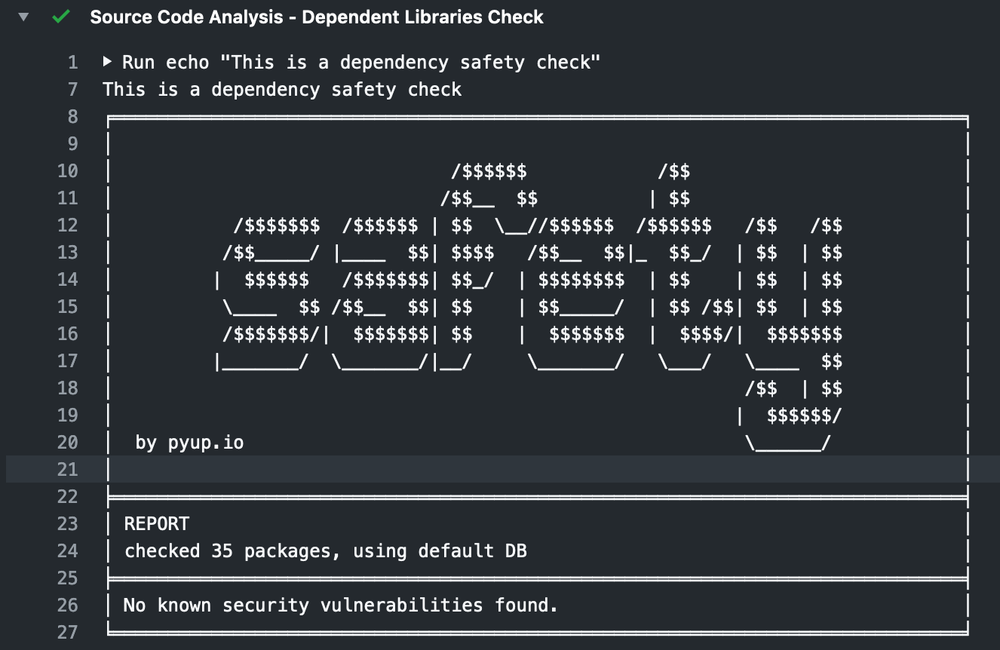

# A DevSecOps Pipeline

### Background - The Problem

ContinuousIntegration(CI) - ContinuousDeployment(CD) pipelines are the places where an application gets built and deployed. Automation plays a major role in stitiching everything together and helps in faster delivery to market/customer. Traditional pipelines tend to miss/ignore security in the process.

### Solution

DevSecOps enhances the traditional CI-CD pipelines and make security as a first class citizen. Following is an example that demonstrates the DevSecOps pipeline

#### Stage-1: Checkout Source Code

> Securely checkout source code from SCM(GitHub/GitLab/BitBucket/TFS)

##### Best Practices:

* Store All Credentials required for SCM in CI System(jenkins/bamboo/gitlab/github) and use Credential Helpers

* Prevent using username/password for clones instead use AccessTokens with scope only to read/write to the required branches

#### Stage-2: Install Dependencies

> Download dependencies

* InHouse/OpenSource: Artifactory (or) NPM Registry (or) PYPI Registry (or) NuGet (or) GO vendorship

##### Best Practices:

* Download verified packages

* Look for CVE's often released by maintainers of the Registries

#### Stage-3: Run Dependency Safety Checks

> Use tools like safety/ libchecker to verify the dependency packages that were downloaded

#### Stage-4: Static Code Analysis

> Perform a static code analysis using tools like Coverity or SonarQube or VeraCode

