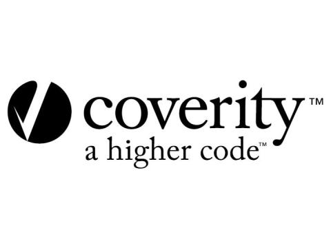

# A DevSecOps Pipeline

### Background - The Problem

ContinuousIntegration(CI) - ContinuousDeployment(CD) pipelines are the places where an application gets built and deployed. Automation plays a major role in stitiching everything together and helps in faster delivery to market/customer. Traditional pipelines tend to miss/ignore security in the process.

### Solution

DevSecOps enhances the traditional CI-CD pipelines and make security as a first class citizen. Following is an example that demonstrates the DevSecOps pipeline

### Stages in Continuous Integration

#### Stage-1: Checkout Source Code

> Securely checkout source code from SCM(GitHub/GitLab/BitBucket/TFS)

##### Best Practices:

* Store All Credentials required for SCM in CI System(jenkins/bamboo/gitlab/github) and use Credential Helpers

* Prevent using username/password for clones instead use AccessTokens with scope only to read/write to the required branches

#### Stage-2: Install Dependencies

> Download dependencies

* InHouse/OpenSource: Artifactory (or) NPM Registry (or) PYPI Registry (or) NuGet (or) GO vendorship

##### Best Practices:

* Download verified packages

* Look for CVE's often released by maintainers of the Registries

#### Stage-3: Run Dependency Safety Checks

> Use tools like safety/ libchecker to verify the dependency packages that were downloaded

#### Stage-4: Static Code Analysis with Code Coverage & Vulnerability

> Perform a static code analysis using tools like Coverity or SonarQube or VeraCode

#### Stage-5: Unit Testing

> Depending on the programming language unit tests should be run on every Pull-Request or Code Changes

##### Best Practices:

* Include test-cases from developer that verifies security of the API/module

* When generating Mock data for tests, generate data required for the security tests

### Stages in Continuous Deployment

#### Stage-6: Scan the Artifacts

> After the artifacts are built, artifacts should be scanned before deployment

##### Best Practices:

* Using [Anchore](https://anchore.com/) docker images can be scanned for CVEs or security flaws

* Using [Docker Content Trust](https://docs.docker.com/engine/security/trust/content_trust/) images can be scanned and allowed to be pushed only if the scan passes

#### Stage-7: Deploy to multiple sources

> Pushing to Docker Registry (ECR/GCR/DockerTrustedRegistry) or Module Registries (NPM/PYPI/Artifactory)

##### Best Practices:

* Ensure secure transfer mechanism at the target deployment site i.e. ensure security of package registries or docker registries

#### Stage-8: Functional Tests

> Functional Tests should be run on the deployed artifact

##### Best Practices:

* Functional Tests should include content-security checks

* Add Functional Tests that should determine if the security levels are expected, additional tests can be done during performance-testing phase.

#### Stage-9: Blue-Green/Alpha-Beta/Canary Deployments

> Blue-Green or Canary style Deployments should be performed as a rolling update

#### Best Practices:

* If an application is rolled-back, it should not leave traces of the previously deployed version

* Check for the potholes opened by the rolled-back application like insecure endpoints left out during the previous deployment
